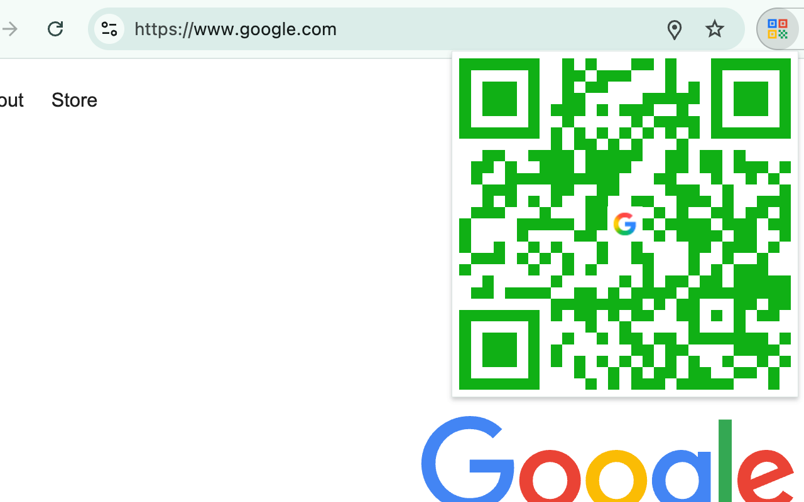
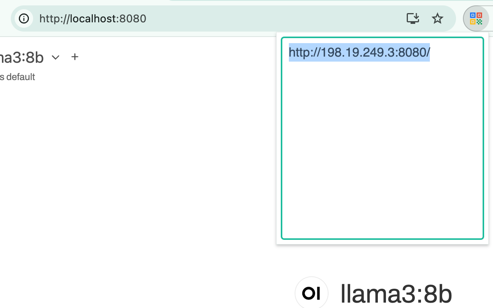

# Colorful QRCode

A Chrome/Firefox extension that generates colorful QR codes for the current page URL or custom text. Colors are randomly generated dark shades — no two scans look the same.

## Screenshots

| QR Code with favicon logo | Edit mode | Localhost → LAN IP |
|:---:|:---:|:---:|
|  |  |  |

## Features

- **Colorful by default** — each QR code uses a random dark color
- **Center logo** — the current site's favicon is overlaid at the center of the QR code
- **HiDPI ready** — crisp rendering on Retina and high-DPI displays
- **Works offline** — all generation happens locally, no network requests
- **Localhost detection** — automatically replaces `localhost` with your LAN IP so mobile devices can reach it (e.g. `http://localhost:3000` → `http://192.168.1.5:3000`)
- **Editable** — click the QR code (or press Enter) to type custom text, then press Enter again to generate

## Install

- [Chrome Web Store](https://chromewebstore.google.com/detail/colorful-qrcode/jblcgcnilflcpendojafkckbbhajclpc)
- [Firefox Add-ons](https://addons.mozilla.org/en-US/firefox/addon/colorful-qrcode/)
- [GitHub Releases](https://github.com/L3au/colorful-qrcode/releases) — download `.zip` and load manually
- Or build from source: `pnpm install && pnpm build`, then load `.output/chrome-mv3/` as an unpacked extension

## Development

```bash
pnpm install          # Install dependencies
pnpm dev              # Dev mode with hot reload
pnpm build            # Production build
pnpm typecheck        # TypeScript check
pnpm test             # Vitest
```

## Tech Stack

TypeScript · WXT (Vite) · Manifest V3 · Vitest

## License

MIT
